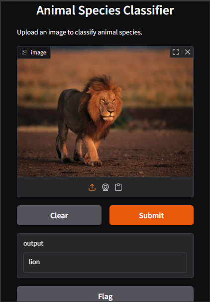

## Overview
This project uses handcrafted feature extraction with a PyTorch-based MLP for classifying animal images. It includes:
- **Feature extraction script** using color histograms, HOG, LBP, Hu Moments.
- **Model training script** (`model_train.py`) for training and evaluating the classifier.
- **Gradio UI (`start.py`)** for easy drag-and-drop image testing.

## Workflow
1. `make.py`: Downloads images from Bing to create your dataset automatically.
2. `feature_extraction.py`: Extracts features from your dataset and saves them.
3. `model_train.py`: Loads features, trains an MLP, shows accuracy, classification report, and confusion matrix, and saves the trained model.
4. `start.py`: Launches a Gradio interface to upload images and get predictions.

## Gradio UI Button Functions
- **Upload Image:** Upload your test image.
- **Submit Button:** Runs the model and returns the predicted class.
- **Clear Button:** Clears the current image and result.
- **Flag Button (if enabled):** Lets you mark misclassifications for later review.

## Model Insights
- Displays **test accuracy** after training.
- Shows **classification report** for precision, recall, and F1-score.
- Visualizes a **confusion matrix heatmap** for class-wise evaluation.
- Saves the model (`pytorch_animal_classifier.pth`) for deployment.

## Requirements
- Python 3.9/3.10/3.11
- torch, torchvision, numpy, scikit-learn, seaborn, matplotlib, gradio

## Running
1. Run feature extraction:
    ```bash
    python feature_extraction.py
    ```
2. Train the model:
    ```bash
    python model_train.py
    ```
3. Launch Gradio interface:
    ```bash
    python start.py
    ```
## OR for Simple Running 
You can **simply download the project** and run:

```bash
python start.py
```
        
## Output Samples





## Accuracy and Confusion Matrix


